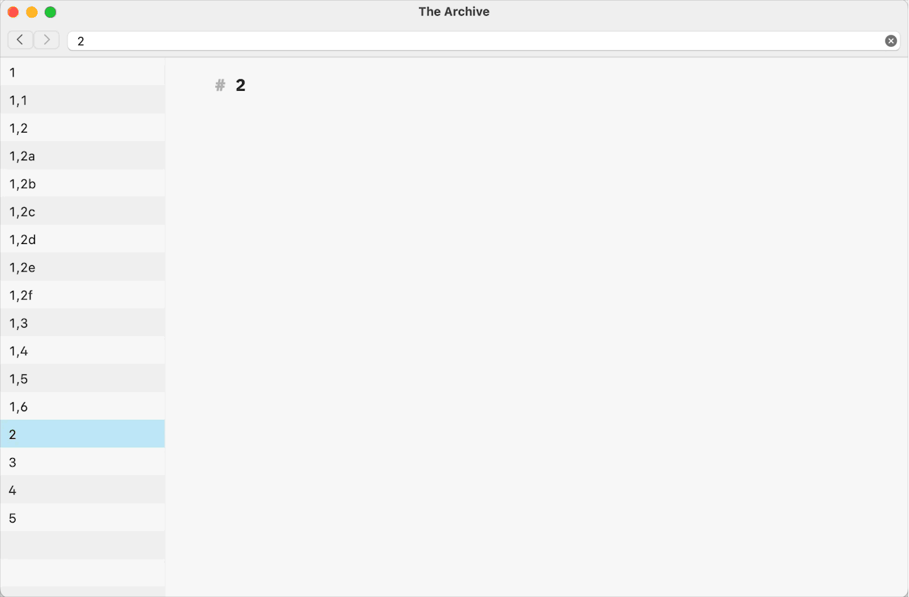

# The New Lower-Level Note Plug-in for The Archive

This is one of two plugins for [The Archive](https://zettelkasten.de/the-archive/) that automate the folgezettel naming convention.

The New Lower-Level Note plug-in is supposed to work in a Folgezettel-based Zettelkasten.

The plug-in ignores any occurrences of Citekeys as `Baljeu1974` or Timestamp IDs as `202412291635` in the filenames. It extracts the Folgezettel ID from the selected note’s filename. Then the plug-in compares the extracted ID to the rest ones presented in the filenames to generate the next available Folgezettel ID of the new level related to the one in the selected note’s filename.

The plug-in will extract Folgezettel ID from any position in the filename, assuming `1,1a Note name`, `Note name 1,2c`, `Note Name 1,3f with additional information in the filename` as possible examples. The plug-in will ignore and won’t extract a Folgezettel ID if the selected note filename contains a Timestamp ID or a Citekey.

The following list of notes’ filenames is the basis for the description of the plug-in algorithms.

- `1`
- `1,1`
- `1,2`
- `1,2a`
- `1,2b`
- `1,3`
- `2`
- `2,1`
- `2,1a`
- `…`
- `2,1z`

Assuming that the selected note has a filename of `1,2a`, the plug-in will create a note with `1,2a1` filename and the `H1 level` heading with the new Folgezettel ID as its content.

For the filenames ending with the digital part of the Folgezettel ID, the plug-in creates an available Folgezettel ID of the next level, following the same logic as with the alphabetical parts. For example, the filename `1,2` will result in the note with the Folgezettel ID `1,2c`, and the filename `2` gives a Folgezettel ID of `2,2`.

In the extreme cases, when the alphabetical part of the existing Folgezettel ID ends with the `z` character, the new ID generated by the plug-in will get an additional `a` character at the end of the initial alphabetical part. The new level of Folgezettel ID for the note `2,1` will become `2,1za` because `2,1z` exists in the exemplified note list.

## Plugin Demonstration

## Installation of the Plugin

1. Download a zip file on the [release page](https://github.com/stebackov/new_lower-level_note/releases/).
2. Unzip it.
3. Double-click on the .thearchiveplugin bundle to install the plugin.
